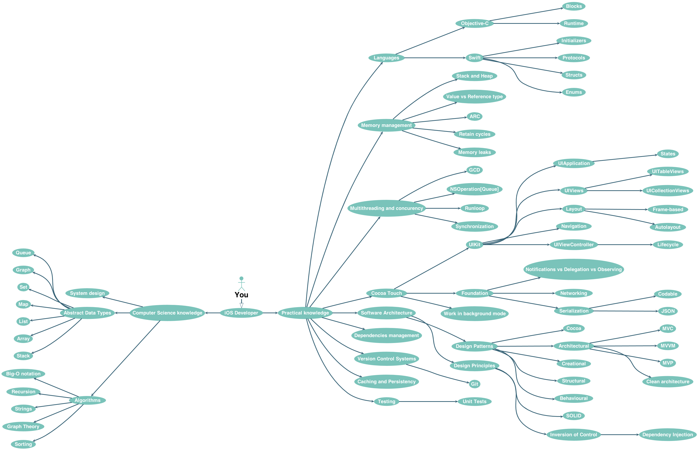

# 🚀 iOS Developer Roadmap
Roadmap to becoming an iOS developer in 2018.

## ☝️ What is it?
This is a tree-like compilation of topics highly relevant to iOS development. Both image and text version are generated from human readable content file.

## ✌️ Who is it for?
The roadmap will be helpul for:

- anyone who wants to become an iOS developer
- iOS developers who desire to become experts
- iOS developers who are preparing for interviews and need to brush up knowledge
- iOS developers who need to compile own set of interview questions

## 👌 Why these topics?
See [this article](https://medium.com/@borlov/c9a24f413457) explaining selection of topics.

## 👨‍🎓 How to use this roadmap
1. Find a topic you want to study.
2. Go to corresponding resources section.
3. Study until you can confidently explain the topic to your cat.
4. (Optional) tick the checkbox next to the topic. [How to tick a checkbox](HowTo/HOWTOCHECKBOX.md).
4. Go to step 1.

`Essential topics` are topics which significantly contribute to understanding of iOS development. Consequently, it is a good idea to study them first as they are often encountered on interviews.

Start from `Getting started` section if you haven't done any iOS development yet.

## 🗺 Image version
Roadmap of essential topics. Roadmap for all topics is [here.](RoadmapProject/Script/Generated/ROADMAP.png)

## 📝 Text version
[Text version with materials to study.](RoadmapProject/Script/Generated/ROADMAP.md)

## 🤝 How to contribute

- add new topics to `Content.yml`
- add missing study materials to `Content.yml`

[The complete contribution guide.](HowTo/HOWTOPR.md)

## ⚙️ Generation status

## Attribution

Based on the work of [Bohdan Orlov](https://github.com/BohdanOrlov)

## 📃 License

